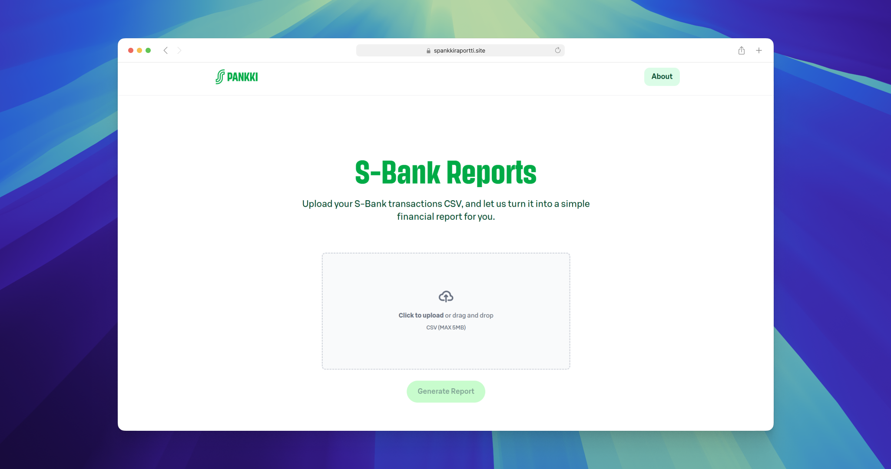

<div align="center">
  <h1>S-Bank Reports</h1>
  <a href="https://github.com/hagelstam/s-bank-reports/actions">
    
  </a>
  &nbsp;
  <a href="https://github.com/hagelstam/s-bank-reports/commits/main">
    
  </a>
  &nbsp;
  <a href="https://github.com/hagelstam/s-bank-reports/blob/main/LICENSE">
    
  </a>
</div>

### 📷 Demo

<a href="https://spankkiraportti.site">
  
</a>

### ⚙️ Getting started

Install dependencies:

```bash
pnpm install
```

Start the development server:

```bash
pnpm dev
```

### 👾 Built with

- [Next.js](https://nextjs.org/)
- [Tailwind CSS](https://tailwindcss.com/)

### 🎓 License

This project is licensed under the terms of the [MIT](https://choosealicense.com/licenses/mit/) license.
